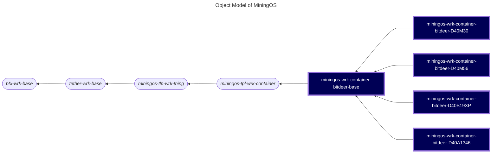

# miningos-wrk-container-bitdeer

A worker service for managing Bitdeer D40 cooling containers with oil and water cooling systems for MiningOS. This service provides comprehensive monitoring and control capabilities for multiple miner models via MQTT protocol.

## Table of Contents

1. [Overview](#overview)
2. [Object Model](#object-model)
3. [Worker Types](#worker-types)
4. [Requirements](#requirements)
5. [Installation](#installation)
6. [Configuration](#configuration)
7. [Running the Worker](#running-the-worker)
8. [API Documentation](#api-documentation)
9. [Alert System](#alert-system)
10. [Controll Operations](#controll-operations)
11. [Mock Server](#mock-server)
12. [Testing](#testing)
13. [Development](#development)
14. [Troubleshooting](#troubleshooting)

## Overview

The Bitdeer D40 container worker provides a unified interface for managing cooling containers with dual oil and water cooling systems. It supports real-time monitoring, temperature control, power management, and sophisticated operational tactics for optimizing mining operations.

## Object Model

The following is a fragment of [MiningOS object model](https://docs.mos.tether.io/) that contains the concrete class representing **Bitdeer Container workers** (highlighted in blue). The rounded nodes reprsent abstract classes and the square nodes represents a concrete classes:



Check out [miningos-tpl-wrk-container](https://github.com/tetherto/miningos-tpl-wrk-container) for more information about parent classes.

### Key Features

- Dual Cooling System: Separate oil and water circulation systems with independent pump control
- PDU Management: Control and monitor individual power distribution unit sockets
- Dry Cooler Control: Manage multiple dry cooler units with fan arrays
- Temperature Monitoring: Comprehensive temperature tracking for hot/cold oil and water
- Operational Tactics: Start/stop policies based on electricity prices or coin prices
- UPS Integration: Monitor uninterruptible power supply status
- Alert System: Configurable alerts for pumps, temperature, and system faults
- MQTT Communication: Real-time communication with containers via MQTT protocol

## Worker Types

The system supports four miner models, each with its own worker type:

- wrk-container-rack-d40-m56 For M56 miners
- wrk-container-rack-d40-m30 For M30 miners
- wrk-container-rack-d40-a1346 For A1346 miners
- wrk-container-rack-d40-s19xp For S19XP miners

 *All worker types share the same alert definitions and core functionality.

## Requirements

- Node.js >= 20.0
- MQTT broker* accessible to both worker and containers
- Network connectivity to container control systems
- Proper configuration files in place

 *Users don't need to install Mosquitto or another MQTT broker.

## Installation

1. Clone the repository:
```bash
git clone https://github.com/tetherto/miningos-wrk-container-bitdeer.git
cd miningos-wrk-container-bitdeer
```

2. Install dependencies:
```bash
npm install
```

3. Set up configuration files:
```bash
./setup-config.sh
```

## Configuration

### Configuration Files Structure

```
config/
├── base.thing.json      # Container monitoring and alert configuration
├── common.json          # Common settings (logging, debug)
└── facs/               # Facility-specific configurations
    ├── miningos-net.config.json
    ├── net.config.json
    └── store.config.json
```

### Key Configuration Parameters

#### base.thing.json
- `collectSnapTimeoutMs`: Timeout for collecting snapshots (default: 120000ms)
- `collectSnapsItvMs`: Interval for collecting snapshots (default: 60000ms)
- `logRotateMaxLength`: Maximum log file length before rotation (default: 10000)
- `logKeepCount`: Number of log files to keep (default: 3)
- `thingRtdConcurrency`: Concurrent real-time data operations (default: 500)
- `container.delay`: Delay between operations (default: 100ms)
- `container.timeout`: Operation timeout (default: 30000ms)
- `alerts`: Miner-specific alert definitions with severity levels

#### common.json
- `dir_log`: Directory for log files (default: "logs")
- `debug`: Debug level (0 = off, 1 = on)

### Alert Configuration

All miner models share the same alert types with configurable parameters:

```json
"oil_min_inlet_temp_warn": {
  "description": "Oil tank inlet temperature is too low.",
  "severity": "medium",
  "params": {
    "temp": 20  // Configurable threshold
  }
}
```

## Running the Worker

### Starting the Worker Service

For M56 miners:
```bash
node worker.js --wtype wrk-container-rack-d40-m56 --env development --rack 1
```

For other miner types, replace the worker type accordingly:
- M30: `--wtype wrk-container-rack-d40-m30`
- A1346: `--wtype wrk-container-rack-d40-a1346`
- S19XP: `--wtype wrk-container-rack-d40-s19xp`

### Registering a Container

After starting the worker, register a container:

```bash
hp-rpc-cli -s wrk-d40 -m registerThing -d '{"info":{"container":"bitdeer-9a"},"opts":{"containerId": "bitdeer-9a"}}'
```

Parameters:
- `info.container`: Container identifier for display
- `opts.containerId`: MQTT topic prefix for the container

## API Documentation

See [docs/bitdeer.md](./docs/bitdeer.md) for complete API documentation.

### Core Functions

#### Monitoring Operations
- `getDeviceInformation()` - Get pump and dry cooler status
- `getPDUSocketInformation()` - Get PDU socket status and power data
- `getContainerPowerInformation()` - Get total and per-phase power metrics
- `getTemperatureInformation()` - Get all temperature readings
- `getUPSInformation()` - Get UPS status and battery level
- `getTactics()` - Get current operational tactics
- `getAlarmTemperatures()` - Get temperature alarm thresholds
- `getSetTemperatures()` - Get temperature setpoints
- `getTankStatus()` - Get tank enable/disable status
- `getExhaustFanStatus()` - Get exhaust fan status

#### Control Operations
- `setPumpState(pumpType, index, status)` - Control oil/water pumps
- `setPDUSocketState(PDUIndex, socketIndex, status)` - Control PDU sockets
- `setDryCoolerState(dryCoolerIndex, fanIndex, status)` - Control dry cooler fans
- `setStopTactic(tacticType, stopPrice, currentPrice)` - Set stop tactics
- `setStartTactic(tacticType, startPrice, currentPrice)` - Set start tactics
- `setHotOilAlarmTemperature(temperature)` - Set hot oil alarm threshold
- `setHotWaterAlarmTemperature(temperature)` - Set hot water alarm threshold
- `setColdOilAlarmTemperature(temperature)` - Set cold oil alarm threshold
- `setColdWaterAlarmTemperature(temperature)` - Set cold water alarm threshold
- `setColdOilTemperature(temperature)` - Set cold oil target temperature
- `setExhaustFanTemperature(fanTemperature)` - Set exhaust fan trigger temperature
- `setTankEnabled(tankIndex, status)` - Enable/disable tanks
- `setAirExhaustEnabled(status)` - Enable/disable exhaust system
- `resetAlarm()` - Reset active alarms
- `setAutoRun(state)` - Set automatic operation mode

### RPC Methods

The Bitdeer container worker exposes RPC (Remote Procedure Call) methods that allow external systems to interact with containers. These methods are accessed through the RPC server and provide both management and control capabilities.

#### Container Management Methods

##### `registerThing(req)`
Registers a new container with the worker system. This method creates a new container instance and establishes MQTT communication.

**Parameters:**
- `req.id` (optional): Unique identifier for the container. If not provided, a UUID will be generated automatically
- `req.info`: Container metadata object
  - `req.info.container`: Display name for the container
- `req.opts`: Container options object
  - `req.opts.containerId`: MQTT topic prefix for container communication
- `req.tags` (optional): Array of custom tags for categorization

**Example:**
```javascript
{
  "info": {
    "container": "bitdeer-9a"
  },
  "opts": {
    "containerId": "bitdeer-9a"
  },
  "tags": ["production", "zone-a"]
}
```

**Returns:** `1` on successful registration

##### `updateThing(req)`
Updates an existing container's configuration or metadata. This method allows modification of container properties without requiring re-registration.

**Parameters:**
- `req.id` (required): Container ID to update
- `req.info` (optional): New or updated metadata
- `req.opts` (optional): New or updated options
- `req.tags` (optional): New tag array (replaces existing tags)
- `req.forceOverwrite` (optional): When true, completely replaces info instead of merging

**Returns:** `1` on successful update

##### `forgetThings(req)`
Removes one or more containers from the system. This disconnects MQTT communication and removes all stored data.

**Parameters:**
- `req.query`: MongoDB-style query to select containers
  - `req.query.id.$in`: Array of container IDs to remove
- `req.all`: When true, removes all containers (use with caution)

**Example:**
```javascript
// Remove specific containers
{ "query": { "id": { "$in": ["container-1", "container-2"] } } }

// Remove all containers
{ "all": true }
```

**Returns:** `1` on successful removal

#### Query and Information Methods

##### `listThings(req)`
Lists all registered containers with their current status and configuration.

**Parameters:**
- `req.query` (optional): MongoDB-style query for filtering
- `req.fields` (optional): Field projection for returned data
- `req.sort` (optional): Sort criteria
- `req.offset` (optional): Number of items to skip (default: 0)
- `req.limit` (optional): Maximum items to return (default: 100)
- `req.status` (optional): When true, includes last snapshot and alert status

**Returns:** Array of container objects with metadata and status

##### `queryThing(req)`
Executes a method on a specific container's control interface. This provides direct access to container operations.

**Parameters:**
- `req.id` (required): Container ID
- `req.method` (required): Method name to execute
- `req.params` (optional): Array of parameters for the method

**Example:**
```javascript
// Query container power information
{
  "id": "bitdeer-9a",
  "method": "getContainerPowerInformation",
  "params": []
}
```

**Returns:** Method-specific response data

##### `getRack(req)`
Retrieves information about the current rack (worker instance).

**Returns:**
- `id`: Rack identifier
- `rpcPubKey`: RPC server public key for authentication

#### Operational Methods

##### `applyThings(req)`
Applies operations to multiple containers simultaneously. This method enables batch operations and coordinated control.

**Parameters:**
- `req.method` (required): Operation to apply
- `req.params` (optional): Parameters for the operation
- `req.query` (optional): MongoDB-style query to select target containers

**Supported Operations for Bitdeer:**
- `switchContainer`: Enable/disable containers
- `switchSocket`: Control PDU sockets
- `switchCoolingSystem`: Control cooling systems
- `setTankEnabled`: Enable/disable oil/water tanks
- `setAirExhaustEnabled`: Control exhaust fan system
- `resetAlarm`: Clear active alarms
- `setTemperatureSettings`: Configure temperature thresholds

**Example:**
```javascript
// Turn off all containers in zone-a
{
  "method": "switchContainer",
  "params": [false],
  "query": { "tags": "zone-a" }
}

// Set temperature settings for specific container
{
  "method": "setTemperatureSettings",
  "params": [{
    "coldOil": 25,
    "hotOil": 55,
    "exhaustFan": 40
  }],
  "query": { "id": { "$in": ["bitdeer-9a"] } }
}
```

**Returns:** Count of successfully processed containers

#### Monitoring and Logging Methods

##### `tailLog(req)`
Retrieves historical log data for containers. This method provides access to time-series data for analysis and troubleshooting.

**Parameters:**
- `req.key` (required): Container ID or log identifier
- `req.tag` (required): Log type (e.g., "5m" for 5-minute logs)
- `req.offset` (optional): Log offset for pagination
- `req.limit` (optional): Maximum entries to return
- `req.start` (optional): Start timestamp (milliseconds)
- `req.end` (optional): End timestamp (milliseconds)
- `req.reverse` (optional): When true, returns newest entries first
- `req.fields` (optional): Field projection for returned data

**Example:**
```javascript
// Get last 10 snapshots for a container
{
  "key": "thing",
  "tag": "5m-bitdeer-9a",
  "limit": 10,
  "reverse": true
}
```

**Returns:** Array of log entries with timestamps and snapshot data

#### Using RPC Methods

RPC methods are typically called using the hp-rpc-cli tool or programmatically through the RPC client library:

```bash
# Register a container using CLI
hp-rpc-cli -s wrk-d40 -m registerThing -d '{"info":{"container":"bitdeer-9a"},"opts":{"containerId":"bitdeer-9a"}}'

# Query container status
hp-rpc-cli -s wrk-d40 -m queryThing -d '{"id":"bitdeer-9a","method":"getSnap"}'

# Apply batch operation
hp-rpc-cli -s wrk-d40 -m applyThings -d '{"method":"switchCoolingSystem","params":[true],"query":{}}'
```

#### Method Execution Flow

When an RPC method is called, the following sequence occurs:

1. **Request Reception**: The RPC server receives and validates the request
2. **Authentication**: Request is authenticated using RPC keys if configured
3. **Thing Selection**: For operations on containers, the query selects target containers
4. **Method Execution**: The requested method is executed on selected containers
5. **Response Collection**: Results are aggregated and formatted
6. **Response Return**: Final response is sent back to the caller

For container-specific operations, the worker maintains MQTT connections to each registered container, allowing real-time command execution and data collection.

## Alert System

The system monitors various fault conditions with three severity levels:
- **critical**: Immediate action required (pump failures, overheating)
- **high**: Significant issues requiring attention
- **medium**: Monitoring conditions (low inlet temperature)

### Common Alerts (All Models)
- **Pump Errors**: Thermal relay actions requiring manual reset
- **Temperature Warnings**: Hot/cold oil and water temperature limits
- **Pump Operation**: Detection of pump control signal without pump running
- **Inlet Temperature**: Low oil inlet temperature warning (configurable)

## Control Operations

### Pump Control
```javascript
// Start oil pump 1
setPumpState('oilPump', 1, true)

// Stop water pump 2
setPumpState('waterPump', 2, false)
```

### PDU Socket Control
```javascript
// Turn on PDU 0, socket 1
setPDUSocketState(0, 1, true)

// Turn off all sockets on all PDUs
setPDUSocketState(-1, -1, false)
```

### Operational Tactics

Set policies for automatic start/stop based on market conditions. Examples:

```javascript
// Set stop policy based on electricity price
setStopTactic('electricityPolicy', 0.10, 0.08)  // Can be used to stop when price > $0.10/kWh

// Set start policy based on coin price
setStartTactic('coinPricePolicy', 50000, 48000)  // Can be used to start when BTC > $50,000
```

## Mock Server

For development and testing without real hardware:

```bash
# Basic usage
node mock/server.js --type D40_M56 --id bitdeer-9a

# With custom MQTT port
node mock/server.js --type D40_M56 --id bitdeer-9a -p 10883

# With error simulation
node mock/server.js --type D40_M56 --id bitdeer-9a --error
```

### Mock Server Options
- `--type`: Container type (required) - D40_M56, D40_M30, D40_A1346, or D40_S19xp
- `--id`: Container ID for MQTT topics (default: C024_D40)
- `-p, --port`: MQTT server port (default: 10883)
- `-h, --host`: MQTT server host (default: 127.0.0.1)
- `--error`: Enable error response simulation
- `--bulk`: Load multiple containers from JSON file

### Mock Server Capabilities

Extended features can be enabled by appending capabilities to the type:

```bash
# Enable pressure monitoring simulation
node mock/server.js --type D40_M56+P --id bitdeer-9a
```

Available capabilities:
- `P` - Pressure monitoring updates

## Testing

Run the complete test suite:
```bash
npm run test
```

## Development

### Quick Start for Development

Using npm scripts:
```bash
# Start mock MQTT server with M56 container
npm run mock

# Start worker for M56 miners
npm run worker
```

This starts:
- Mock MQTT server on port 4001 with debug logging
- Worker configured for development environment

### Project Structure
```
workers/
├── lib/
│   ├── alerts.js         # Alert processing
│   ├── container.js      # Core container class
│   ├── stats.js          # Statistics processing
│   ├── utils/
│   │   ├── constants.js  # System constants
│   │   ├── optimize.js   # Optimization algorithms
│   │   └── pduOps.js     # PDU operations
│   └── worker-base.js    # Base worker class
└── *.wrk.js             # Miner-specific workers
```

## Troubleshooting

### Common Issues

1. **MQTT Connection Failed**
   - Verify MQTT broker is running
   - Check container ID matches between worker and container
   - Ensure network connectivity to MQTT broker

2. **Container Not Responding**
   - Check container is publishing to correct MQTT topics
   - Verify container ID in registration matches actual container
   - Monitor MQTT traffic for communication issues

3. **Temperature Alarms**
   - Adjust alarm thresholds in runtime using API
   - Check physical cooling system operation
   - Verify temperature sensor readings

4. **PDU Socket Control Issues**
   - Ensure manual/automatic switch is in "automatic" position
   - Check PDU index and socket index are valid
   - Verify power to PDU units

### Debug Mode

Enable comprehensive debug logging:
```bash
# Set debug in config
echo '{"dir_log": "logs", "debug": 1}' > config/common.json

# Or use DEBUG environment variable
DEBUG=* node worker.js --wtype wrk-container-rack-d40-m56 --env development --rack 1
```
